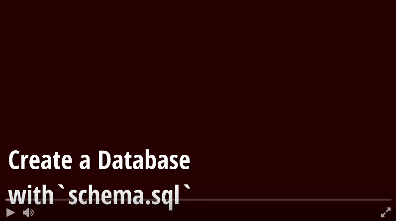

# e-commerce-back-end

## Description

The back end of an E-Commerce project needed RESTful endpoints (Express) implemented to interact the MySQL database holding the models (Sequelize).

Sequelize (with the help of mysql2) was used to create and establish relationships between the tables in the store, in addition to forming maintainable queries in relation to each endpoint.

Express, with modular routing, makes creating NodeJS html servers easy with it's straight forward syntax, comprehensive docs, and flexible 'middleware' interface. In this project, it was used to set up API endpoints.

## Demo Video

## Tech Stack

* JavaScript
* Sequelize
* Express
* mysql2
* dotenv
